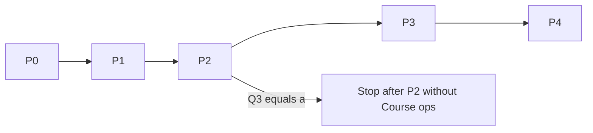

# DIPI Staff Java desktop — phase-wise plan

> **For agentic workers:** This plan is **planning output**, not a licence
> to start coding in the planning session. The implement session pastes
> `docs/handovers/2026-09-05-java-desktop-handover.md` and executes **one
> phase at a time**. REQUIRED later: scoped workers with strict file
> ownership, then one integrator. Do not invoke `executing-plans` until
> that handover is the session brief.

**Goal:** A JavaFX 21 / JDK 21 desktop client that is behaviourally
equivalent to Android DIPI Staff 1.42.0 for registrar day-0 work, then
Course ops, then installers.

**Architecture:** Sibling repo `dipi-desktop`. Four Gradle modules
(`model`, `net`, `store`, `app`). One `DeskFacade` (MVVM) owns
navigation. `java.net.http.HttpClient` plus a first-party cookie store
speaks Drupal HTML. JavaFX WebView is sheets-only and cookie-isolated.

**Tech Stack:** Java 21, JavaFX 21, Gradle, JUnit 5, TestFX (hard-rule
UI only), SQLite JDBC, OS credential store, `jpackage`.

**Spec:** `docs/superpowers/specs/2026-09-05-java-desktop-design.md`
(lives in the Android repo until P0 copies the docs set into
`dipi-desktop`).

## Global Constraints

- Live host `https://dipi.vridhamma.org`. No `/staff/*` as the live default.
- Wipe cookies before login. Prefer `GET /user/login`. Persist the full `SESS` jar.
- Centre from `dh_user_center`. No hardcoded centre.
- Worklist = `GET /search-course/{cid}/{courseId}?s=&t=&g=&d=a` + `var dataset`. Never `POST /search-app`.
- Sheet GET query names = `{conf, seating}` only. Never `r`.
- Never send `Approved`. Status write `l=0`.
- `GET /teacher-list` once per entry, never polled. Comments never parsed.
- `/application-view` allowlist only.
- Server messages verbatim.
- Design file wins look; Android tree wins "what the product does".
- No NPI in DB, DTO-on-disk, or logs.
- No cookie transfer to the system browser or the sheet WebView.
- Dark = Steel night ramp. Lotus is a vector. No photo hero.
- Do not edit the Android production tree except docs. No Pixel C `adb` in this plan.
- Do not commit credentials, keystores, or real student data.
- JavaFX skills are checklists. `AGENTS.md` hard rules win.
- Package root: `org.dhamma.dipi.desk`.

---

## File-ownership map (all phases)

```
dipi-desktop/
  settings.gradle.kts
  gradle/libs.versions.toml
  model/   org.dhamma.dipi.desk.model
  net/     org.dhamma.dipi.desk.net + .parse + .mock
  store/   org.dhamma.dipi.desk.store
  app/     org.dhamma.dipi.desk + .ui + .desk
  docs/    AGENTS.md, DESIGN.md, DECISIONS.md (desktop copies)
```

A worker owns **one module** plus that module's tests unless the phase
table says otherwise. The integrator alone bumps SemVer, runs the full
suite, and (P4) builds installers.

Android oracle paths (read-only):

- `/Users/wizops/DIPI/dipi-app/core/model/...`
- `/Users/wizops/DIPI/dipi-app/core/network/...`
- `/Users/wizops/DIPI/dipi-app/docs/design/DIPI-Staff.dc.html`

---

## Phase index

| Phase | Working software | Version | Modules |
|---|---|---|---|
| P0 | Empty window, HTTP client, cookie jar, login scrape tests, `SheetRouteSafety`, mock dispatcher. No registrar UI. | `0.1.0` | all four scaffolded; UI is a title label |
| P1 | Vertical 1: login, centre (matrix + 4 older + 4 tiles), worklist, card, change-status, settings | `0.2.0` | model + net + store + app/login+centre+card+settings |
| P2 | Desk shell + six sections + sheets + allocation sync + Course report | `1.0.0` | app/desk + net/sheets |
| P3 | Course ops (only if Q3 stays b/c). PIN, teacher list, hall, student card, 5i print | `1.1.0` | app/teacher + store/courseops |
| P4 | `jpackage` Linux / Windows / macOS + one-page runbook | `1.2.0` | packaging only |

Do not start Pn+1 until Pn is green and the integrator has bumped the
version. Do not implement anything that is not in the current phase.



---

## P0 — Foundation (`0.1.0`)

**Done when:** `./gradlew :model:test :net:test :store:test :app:test`
is green, a window titled `DIPI Staff` opens at 1280×900, mock login
HTML is scraped, sheet GET construction cannot carry `r`, and
`Approved` cannot become a query map.

### Slice P0.1 — Gradle skeleton

**Owner:** integrator.
**Files:** `settings.gradle.kts`, `gradle/libs.versions.toml`, four
`build.gradle.kts`, `app/.../MainApp.java` (JavaFX `Application`, empty
`Label`), `module-info.java` requiring `javafx.controls` only.
**Tests:** `MainAppTest` boots the toolkit (or a headless smoke if CI
has no display — document the flag).
**Do not:** add `javafx.web` yet, FXML, DI framework.

### Slice P0.2 — Model hard rules

**Owner:** `model` worker.
**Create:**

```
model/src/main/java/org/dhamma/dipi/desk/model/
  ApplicantStatus.java      // isForbiddenWrite("Approved")
  StatusWrite.java          // query(s, l=0, c) throws on Approved
  StatusChangeResult.java
  SheetExport.java          // labels match Android enum
  SheetSort.java            // ALLOWED_QUERY_NAMES = {conf, seating}
  SheetRoute.java           // Page / DaySummary / Document / ReportForm
  SheetRoutes.java          // of(export) — same slugs as Android
  RoomAllocSync.java        // params() field set + empty l/v
  ConfPrefix.java
  CourseMatrix.java         // cardRows; zero → "·"
  Backrest.java             // BACKREST_GLYPH = "⌐"
  SeatKind.java
  SeatGrid.java             // CW-A1 nearest Dhamma seat
  NpiNames.java             // aadhar, passport, voterid, pancard, ae_
```

**Tests (named):** `StatusWriteTest`, `SheetExportTest`,
`SheetSortAllowlistTest`, `RoomAllocSyncTest`, `ConfPrefixTest`,
`CourseMatrixTest`, `BackrestTest`, `SeatGridTest`, `NpiNamesTest`.
Oracle: Android `core/model/src/test/...` of the same names.

**Interfaces this slice produces:**

```java
public final class StatusWrite {
  public static Map<String, String> query(String status, int letterId, String comment);
}
public final class SheetSort {
  public static final Set<String> ALLOWED_QUERY_NAMES = Set.of("conf", "seating");
  public static List<SheetSort> optionsFor(SheetExport export);
}
public final class RoomAllocSync {
  public static Map<String, String> params(CheckInRecord record);
}
```

### Slice P0.3 — HTTP client + cookie store

**Owner:** `net` worker.
**Create:** `DeskHttp.java`, `PersistentCookieStore.java`,
`ResponseBodies.java` (`html()` on 200 and 403).
**Tests:** `PersistentCookieStoreTest` (Set-Cookie round-trip, wipe,
logout-keeps-remember-me is a store concern — cookies wipe on
`clearSession()`). `ResponseBodiesTest` (403 body readable).
**Do not:** talk to the live host in CI.

### Slice P0.4 — Login form scrape + mock dispatcher

**Owner:** `net` worker.
**Create:** `LoginFormParser.java`, `MockDeskServer.java` (serves the
Android login-block fixture).
**Tests:** `LoginFormParserTest` — action, `form_build_id`, `form_id`
from both 200 `/user/login` and 403 `/` fixtures copied from the
Android tree.

### Slice P0.5 — SheetRouteSafety + StatusWrite at the HTTP seam

**Owner:** `net` worker (reads `model`).
**Create:** `SheetRequest.java` that is the **only** builder for
`GET /{sheet}/{cid}/{courseId}`.

```java
public final class SheetRequest {
  public static HttpRequest get(URI base, String slug, int cid, int courseId, SheetSort sort);
}
```

**Tests:** `SheetRouteSafetyTest` — reflect or inspect the built URI;
fail if any query name is outside `{conf, seating}`; fail if `r`
appears; fail if a sort not in `optionsFor(export)` is applied.
`StatusWriteHttpTest` — building a change-status request with
`Approved` never calls `HttpClient`.

### Slice P0.6 — Store wipe contract (empty impl)

**Owner:** `store` worker.
**Create:** `SecretStore.java`, `PrefStore.java`, `OutboxStore.java`
with `eraseAll()` / `clearSession()`.
**Tests:** `EraseAllTest` — after erase, cookie file, prefs, and outbox
are gone; remember-me is gone only on erase-all, not on logout.

### P0 hand-verification

- `./gradlew :app:run` shows the empty window on the developer OS.
- No live credentials used.

### P0 rollback

Delete the sibling repo. Android is untouched.

### P0 version

Integrator sets `0.1.0` and a `versionCode` of 1.

---

## P1 — Vertical 1 (`0.2.0`)

**Done when:** mock (and, owner-gated, live) login reaches a centre
dashboard with four upcoming matrices, four older courses (2×2 at ≥1100
px), four native tiles; opening a course shows a worklist from
`var dataset`; the public card can change status (never `Approved`);
Settings can remember me, log out, and erase all.

### Slice P1.1 — Centre page parser + older-course limit

**Owner:** `net`.
**Create:** `CentrePageParser.java`.
**Produces:** upcoming links, `olderCourseOptions`, matrix rows, whether
desk tiles are present. Limit **4** applied in the repository, not the
parser (parser stays a faithful page reader).
**Tests:** `CentrePageParserTest` plus `OlderCourseLimitTest` (5 older
→ 4 in server order; 2 older → 2).

### Slice P1.2 — Worklist parser

**Owner:** `net`.
**Create:** `SearchPageParser.java`, `WorklistRow` public fields only.
**Tests:** `SearchPageParserTest` — NPI keys never appear on the row
object (`NpiNames` assertion). Status vocabulary from
`#edit-app-status` with roster fallback.

### Slice P1.3 — Auth + session keep-alive

**Owner:** `net` + `store`.
**Create:** `AuthService.java` (wipe → GET login → POST → follow to
`/centre/{cid}`), `SessionKeeper.java` (20 min).
**Tests:** `AuthServiceMockTest`. Keep-alive 403 → facade navigates
`Login`.

### Slice P1.4 — Login UI

**Owner:** `app` (auth files only).
**Create:** `ui/LoginView.java`, token CSS, lotus SVG.
**Match:** design 1b tall card, error strip verbatim.
**Tests:** TestFX `LoginViewTest` — failed POST shows fixture server
text unmodified; Remember-me checkbox present.

### Slice P1.5 — Centre UI

**Owner:** `app` (course files only).
**Create:** `ui/CentreView.java`, `ui/MatrixCard.java`.
**Match:** DESIGN 1a / 1.42.0 — header `{centre} · {displayName}`,
upcoming 60% ceiling, older 2×2 wide / vertical narrow, four tiles,
zero = `·`, next-course accent bar on the soonest only.
**Tests:** `CentreViewTest` (four older → two rows of two at 1280 width).

### Slice P1.6 — Worklist + card + change-status

**Owner:** `app` applicants + `model` status.
**Create:** `ui/WorklistView.java`, `ui/CardView.java`.
**Tests:** `StatusWriteTest` already exists; add `ChangeStatusFacadeTest`
(Approved → snack, zero HTTP). Card does not persist NPI.

### Slice P1.7 — Settings

**Owner:** `app` settings + `store`.
**Create:** `ui/SettingsView.java` — appearance (Steel default, five
skins, dark = night ramp callout), simulate offline, log out, erase all.
**Tests:** `SettingsEraseTest`.

### Slice P1.8 — Browser handoffs

**Owner:** `app`.
**Create:** `DesktopHandoff.java` — `Desktop.getDesktop().browse(uri)`
for Advanced Search (`/search-app/{cid}`) and Add Application
(`/app/add/{cid}/{courseId}`) only.
**Tests:** `DesktopHandoffTest` — URI exact; no Cookie header API
exists on the helper.

### P1 hand-verification (owner-gated live)

- Sign in to the live host from a Linux window. Centre is the account's
  centre, not Giri.
- Failed login shows the server's sentence.
- Erase all, restart: remember-me gone, no leftover cookies.
- Advanced Search opens the OS browser; a fresh browser profile does not
  show the app session.

### P1 rollback

Revert the P1 commits. P0 window + tests remain.

### P1 version

`0.2.0` / versionCode 2.

---

## P2 — Desk + sheets (`1.0.0`)

**Done when:** a course opens into a 190 px rail with six sections;
Board is the 3×3; Day 0 summary and Course report are native; HTML
sheets open in a hardened WebView; documents write under cache and wipe
on logout; Check-in / Rooms merge `#table-attending`; user-initiated
allocation sync posts `RoomAllocSync.params`.

### Slice P2.1 — Desk shell

**Owner:** `app` desk chrome.
**Create:** `ui/DeskShell.java`, `DeskSection.java` (same six labels),
`DeskRail.java`.
**Match:** rail 190, selected = accent100 + 3 px bar. Centre settings
are **not** a rail item.
**Tests:** `DeskShellTest` — six items, order Board → Applications →
Audit → Calling → Check-in → Rooms.

### Slice P2.2 — Sheet transport

**Owner:** `net`.
**Create:** `SheetTransport.java`, `SheetPayload.java` (Html / Document /
Summary / Report / NotAvailable), `DaySummaryParser.java`,
`CourseReportFormParser.java`, `CourseReportCsvParser.java`,
`AttendedTableParser.java`, `AccoHandlerParser.java`.
**Tests:** Android namesakes. `CourseReportCsvParserTest` drops
blank-name zero rows (`EmptyRange`).
**Now add** `javafx.web` to `app` only — `net` stays UI-free.

### Slice P2.3 — Hardened viewer

**Owner:** `app` sheets.
**Create:** `ui/SheetViewerPane.java`.
**Hardening (test each):** JS off; engine cookie handler is empty /
null; `loadContent` only; stylesheet injected; constructed from a
`SheetPayload.Html` already fetched without `r`.
**Tests:** `SheetViewerHardeningTest` (TestFX + engine inspection).

### Slice P2.4 — Board 3×3

**Owner:** `app` board.
**Create:** `ui/BoardView.java`.
**Cells:** Day 0 list, Day 0 summary, Seating plan (native hall placeholder
until P3 — in P2 the cell may open `SheetExport.SeatingPlan` HTML **or**
a "Hall arrives in 1.1" disabled state). **Recommendation:** P2 Board
Seating cell shows the native hall **empty-state** ("Open Course ops in
1.1, or print from the roll once P3 ships") and does **not** GET
`/seating` as the primary surface. Valuable is **off** the Board.
Course summary = `report-day11` PDF. Course report is **not** on the
Board.

### Slice P2.5 — Applications, Audit, Calling, Check-in, Rooms

**Owner:** `app` sections (one worker per pair if parallelising:
Applications+Audit, Calling+Check-in, Rooms).
**Create:** the five panes. Check-in scan buffer is **session-scoped**,
cleared on course pick (`deskScan = ""`).
**Tests:** `CheckInScanResetTest`. `AttendedTableParserTest` already
pins the merge cells.

### Slice P2.6 — Allocation sync

**Owner:** `model` (already has `RoomAllocSync`) + `net` POST + `store`
outbox.
**Tests:** `RoomAllocSyncTest.paramsNeverCarryAStatus`. Facade walk
stops on 401/403.

### Slice P2.7 — Course report centre surface

**Owner:** `app` + `net` (already parsed).
**Create:** `ui/CourseReportView.java` — date range only, no course
picker. Empty range → `EmptyRange` guidance.
**Tests:** `CourseReportViewTest`.

### Slice P2.8 — Print HTML (chits / slips)

**Owner:** `app` print.
**Create:** `print/ChitPrint.java` (12-up), `print/CheckingSlipPrint.java`
(2-up). Use JavaFX `PrinterJob`.
**Do not:** GET a new print endpoint.

### P2 hand-verification

- Board is 3×3, no Male/Female PDF, no Valuable cell, no Course report
  cell.
- Open Day 0 list: table readable, JS disabled (devtools / engine flag).
- Logout wipes `{cache}/sheets`.
- Allocation sync: one pending room posts the dialog fields; server
  refusal text appears unmodified.

### P2 rollback

Revert P2 commits. P1 Vertical 1 remains usable.

### P2 version

`1.0.0` / versionCode 3. First registrar-usable desktop.

---

## P3 — Course ops (`1.1.0`) — skip if Q3 = (a)

**Done when:** `tabletMode` (prefs) flips the window to Teacher list +
Seating plan + student card; PIN gates Settings; roll persists
encrypted; hall is teacher-at-the-bottom; 5i print is one gender per A4
from the in-memory roll; `GET /teacher-list` runs once per entry.

### Slice P3.1 — Mode + PIN

**Owner:** `store` + `app` settings.
**Create:** `CourseOpsStore.java`, `PinStore.java` (salted SHA-256, own
file, survives logout, dies on erase-all).
**Tests:** `CourseOpsStoreTest` (ignoreUnknownKeys equivalent),
`PinStoreTest`.

### Slice P3.2 — Teacher list parser + UI

**Owner:** `net` + `app` teacher.
**Create:** `TeacherListParser.java`, `ui/TeacherListView.java`.
**Tests:** `TeacherListParserTest` — Comments column absent from the
model. Facade: `teacherListFetchedFor` latch.

### Slice P3.3 — Application view allowlist + student card

**Owner:** `net` + `app`.
**Create:** `ApplicationViewParser.java`, `ui/StudentCardView.java`.
**Tests:** `ApplicationViewParserTest`. Health may persist in the
encrypted course-ops store only.

### Slice P3.4 — Hall + 5i print

**Owner:** `app` + `model` (`SeatGrid`).
**Create:** `ui/HallView.java`, `print/SeatingPlanPrint.java`.
**Rules:** teacher at the bottom; letters as columns; numbers ascending
away from the Dhamma seat; CW/CH vertical rail, `CW-A1` nearest;
`BACKREST_GLYPH` prefix; used-only legend on print.
**Tests:** `SeatGridTest` (already), `SeatingPlanPrintTest` (one gender
per page; never calls `/seating`).

### P3 hand-verification

- Entering a course in Course ops triggers **one** teacher-list GET
  (network log). Pull-to-refresh does not fire a second GET.
- Settings asks for PIN. Erase-all clears PIN.
- Hall print does not hit `/seating`.

### P3 rollback

Disable `tabletMode`. P2 registrar desk remains.

### P3 version

`1.1.0` / versionCode 4.

---

## P4 — Installers (`1.2.0`)

**Owner:** integrator only.

- `jpackage` tasks per OS in `app/build.gradle.kts`.
- Bundle JDK 21 + JavaFX (including `javafx.web`).
- One-page `docs/RUNBOOK.md`: install, first login, erase-all, where
  cache/secrets live on each OS.
- No auto-updater.
- Artifact names: `dipi-staff-desktop-<version>.<ext>` plus a stable
  `dipi-staff-desktop.<ext>` if a latest-download link is wanted later.

**Tests:** packaging smoke (`jpackage --type app-image` exists and
launches). Full signed installers are hand-built on each OS.

**Version:** `1.2.0` / versionCode 5.

---

## Execution model (do not run in planning)

Each phase cuts into the slices above. Parallel workers take **disjoint
file sets** from the ownership column. After workers go green on their
scoped `./gradlew :{module}:test`, the integrator:

1. Runs `./gradlew :model:test :net:test :store:test :app:test`.
2. Bumps SemVer.
3. Writes the desktop `DESIGN.md` / `DECISIONS.md` delta.
4. Does not touch Android Kotlin or Pixel C.

The Android repo may gain **one line** in `AGENTS.md` pointing at
`dipi-desktop` after P0 exists — owner-gated, not part of P0.

---

## Risks (plan)

- P2 Board seating vs P3 hall: P2 must not make `GET /seating` the
  habit. Empty-state the cell or skip the HTML primary surface.
- `javafx.web` packaging on Linux: installers must include WebKit
  natives; document the `jpackage` extra-module list.
- Copying Android fixtures: copy text, do not import Kotlin test
  sources into the Java build.
- Two-client drift: any protocol "fix" on desktop is a spec bug. Port
  the Android behaviour, then file an Android change if the desk is
  wrong.

## Plan self-review

- Every spec section maps to a slice (transport → P0.5/P2.2, tokens →
  P1.4–P1.5, Course ops → P3, packaging → P4).
- No TBD. Q3=(a) skips P3 by name.
- Type names (`StatusWrite.query`, `SheetRequest.get`,
  `RoomAllocSync.params`) are consistent across slices.
