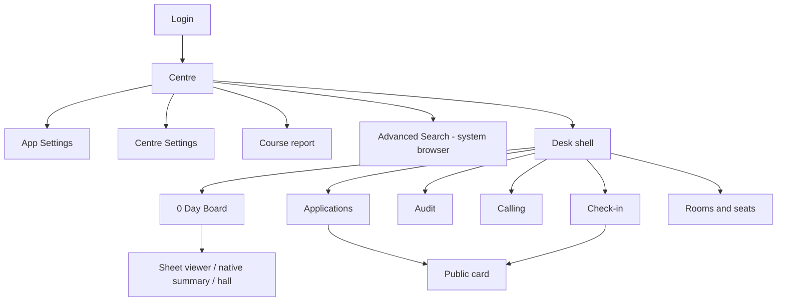
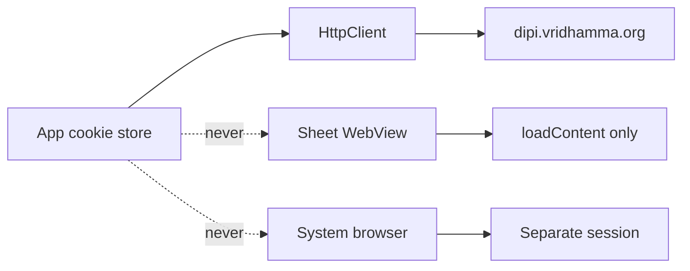

# DIPI Staff — Java desktop twin

**Date:** 2026-09-05
**Status:** planning recommendation. Owner questions Q1–Q8 are listed in
§ Decisions; unanswered items are marked. Implement P0 may start against
the recommended defaults. Do not write production Java in the session that
only reviews this spec.

**Android baseline:** `1.42.0` / `versionCode` 69 on `main` at
`/Users/wizops/DIPI/dipi-app`.
**Inventory:** `docs/handovers/2026-09-05-java-desktop-source-inventory.md`
(re-verified against `StaffApi.kt`, `SheetExport.kt`, `DeskTiles.kt`,
`DeskSection`, `OLDER_COURSE_LIMIT = 4` on 2026-09-05).

This spec designs a **second client**, not a replacement. The Pixel C
Android app stays on its own SemVer and install path.

---

## 1. Product statement

A centre-staff registrar-desk client, written in **Java**, that runs on a
JVM on Linux, Windows, and macOS. It speaks the **same live Drupal HTML
desk** as the Android app (`https://dipi.vridhamma.org`, module
`dh_manageapp`). It is not a WebView wrapper of the whole site, not
student-apply, not the APP `/api`, and not a `/staff/*` JSON client on
the live host.

Success: a staff member who already uses the Pixel C app can sit at a
Linux or Windows machine, sign in with the same Drupal account, and
complete the same day-0 work without learning a new protocol. Visual
fidelity follows `docs/design/DIPI-Staff.dc.html` at a default window of
**1280×900**. Wider windows may grow; they must not invent a third
information architecture.

This is a **clean-room port of behaviour**. Product rules, parser
invariants, and design tokens transfer. Android frameworks do not.

## 2. Non-goals

- New live endpoints or query parameter names.
- Any change to `/Users/wizops/DIPI/dipi-web` or live PHP.
- Kotlin Compose Multiplatform, Electron, a browser rewrite, or wrapping
  the Android APK.
- Server-side Advanced Search (`POST /search-app`) until HAR re-verify
  plus owner sign-off.
- Real photo upload, Group seating, Cell list, Course-ops attendance
  writes, Bulk Mail, Letters, Manage Courses, Daily Activity, SMS Report,
  Male/Female course PDFs, skin photographs.
- A status engine, client ACL, sending `Approved`, sending `r` on a
  sheet GET, cookie handoff to the system browser, NPI in a database or
  log.
- Plugin system, multi-centre dashboard, offline-first sync beyond the
  existing outbox.
- Phone-only chrome as a third IA (Today skeleton, hub overflow menu).
  Desktop is the tablet desk.

## 3. Decisions (Q1–Q8)

Planning recommendations are **locked as the baseline** so P0 can be
specified. The owner may override; the implement handover lists which
phases freeze on which answer.

| # | Question | Baseline | If overridden |
|---|---|---|---|
| Q1 | Repo | **Sibling** `/Users/wizops/DIPI/dipi-desktop`. Android SemVer and Pixel C path stay untouched. | A `:desktop` module inside `dipi-app` is rejected unless the owner insists — it would tangle Gradle Android/JavaFX toolchains. |
| Q2 | Toolkit | **JavaFX 21+ on JDK 21 LTS.** CSS can carry Steel/Paper/Blossom/Pond/Still. WebView for HTML sheets. `jpackage` is first-class. | Swing + FlatLaf is the conservative alternative (no WebView; HTML sheets need a different viewer). SWT ties the app to Eclipse bits — do not pick it. |
| Q3 | Parity for desktop 1.0 | **(b)** Vertical 1 + six-section desk + sheets. Course ops is desktop **1.1** (P3). | (a) stops after P1. (c) pulls P3 into the first ship. Phone hub overflow is not a desktop destination. |
| Q4 | Window | Default **1280×900**, user-resizable, floor **1100×700** so the 190 dp rail still fits. Tokens unchanged. | Free-form layout is out — it invents a third IA. |
| Q5 | Packaging | **`jpackage` per OS** is P4 (required before a centre trial). Fat JAR is an interim developer run, not the ship. | "JAR only" delays P4; do not drop Linux or Windows. |
| Q6 | Secrets | **OS credential store** (libsecret / DPAPI / Keychain) holds remember-me. Cookie jar and course-ops PIN use an app-level encrypted file whose key lives in that store. | A Java KeyStore file under the user config dir is acceptable if OS stores fail on a target OS — it must not be weaker than EncryptedSharedPreferences (AES, not plaintext prefs). |
| Q7 | Course ops on a shared PC | **PIN-as-on-tablet** when P3 ships. P2 does not include Course ops. | Dropping Course ops from desktop entirely is allowed. Gating the whole app on the OS user is weaker than the tablet PIN on a shared reception PC — do not do that silently. |
| Q8 | HTML sheets | **JavaFX WebView** for `Page` exports with the five hardening constraints. Native Java for Day 0 summary, Course report, and the hall. | Native-only HTML renderers are extra work; do not start them in P2. |

Do not invent a ninth question that reopens a settled owner ruling
(`Approved`, NPI, bridge rule, `r`, retired tiles).

`docs/DECISIONS.md` still footers 1.30.5 and still says
`OLDER_COURSE_LIMIT = 3`. The tree wins: limit is **4**
(`StaffRepository.kt`).

## 4. Approaches considered

### 4.1 UI toolkit

| Approach | For | Against |
|---|---|---|
| **A. JavaFX 21+ (recommended)** | WebView, Print API, CSS tokens, `jpackage`, closest to a native desktop shell. MVVM maps onto `DeskViewModel`. | WebView cookie discipline must be proven. Skills that document it have low install counts — treat them as checklists. |
| B. Swing + FlatLaf | Conservative, huge installed base, no extra runtime module. | No WebView. HTML sheets need Java-HTML or an embedded browser (then you have reinvented JavaFX). Print is `PrinterJob` / iText, more glue. |
| C. SWT | Native widgets. | Eclipse dependency, packaging pain, no gain for this product. |

**Pick A.** Scene-graph views in Java (no FXML for product screens). CSS
files hold tokens only. FXML is reserved for none of the registrar
surfaces — it hides the measurements the design file pins.

### 4.2 Architecture

| Approach | For | Against |
|---|---|---|
| **A. MVVM facade (`DeskFacade`) (recommended)** | 1:1 map from `DeskViewModel` / `DeskScreen` / `DeskSection`. Workers can own a screen without touching HTTP. | Facade can become a god-object if services are not split. |
| B. MVCI | Cleaner JavaFX-idiomatic. | Extra vocabulary vs the Android inventory. |
| C. God-controller | Fast P0. | Uncuttable for the multi-agent implement pass. |

**Pick A.** One `DeskFacade` owns navigation and session. Services own
HTTP and stores. Views bind to observable state. No view constructs a
service.

### 4.3 HTTP

| Approach | For | Against |
|---|---|---|
| **A. `java.net.http.HttpClient` + first-party cookie store (recommended)** | JDK, no extra jar on the live path. | Cookie persistence and 403-`errorBody` must be written once and tested. |
| B. OkHttp on the JVM | CookieJar is already proven in the Android tree. | Extra dependency; easy to accidentally copy Android `CookieManager`. |

**Pick A.** Redirects followed except login POST (must observe 302 →
`/centre`). `Response.html()` equivalent: read body on both 200 and 403.
Mock dispatcher is a local `HttpServer` or a test `HttpClient` interceptor
— **not** live `/staff/*`.

### 4.4 Local store

Smallest store that survives a restart:

- Outbox (status / allocation rows).
- One-course cache (worklist public fields only).
- Non-secret prefs (skin, lotus, window bounds).
- Encrypted secrets (cookies, CSRF, remember-me, later PIN + course-ops
  roll).

**SQLite JDBC** for outbox + cache. **No NPI columns.** SQLCipher if a
pure-Java or well-packaged native is available on all three OS; otherwise
SQLite plus the same app-level AES used for the cookie file. Do not use
plain `Preferences` for passwords.

### 4.5 YAGNI

One window, one process, one live host. No plugin system, no tray icon,
no MDI, no auto-updater in v1 (P4 may *name* an updater; it does not
build one).

## 5. Information architecture

Desktop destinations map 1:1 onto tablet `DeskScreen` / `DeskSection`
that a registrar at 1280×900 actually uses.



### In desktop 1.0 (P1–P2)

`Login`, `Centre`, `Card`, `Settings`, `ZeroDay` (Check-in), `Audit`,
`Calling`, `Rooms`, `CentreOps`, `CourseReport`, plus the desk shell
(`Board`, `Applications`) and the sheet overlay.

### Deferred to desktop 1.1 (P3)

`TeacherRoll`, `SeatingPlan`, `TeacherCard`, device PIN, encrypted
course-ops store.

### Not grown on desktop

| Tablet surface | Why |
|---|---|
| `Today` skeleton | Phone list. Desk uses Applications. |
| `CourseHub` + overflow | Phone catalogue. Tablet opens the rail. |
| `Photos` | Mock-only; no live upload. |
| `Search` as an in-app form | Advanced Search is a **URL-only** system-browser handoff (1.41.0). |
| `DeskAction` placeholder | Retired with Bulk Mail. |
| Add Application | URL-only system-browser handoff. No cookies transfer. |

Centre tiles stay the four native ones (`centreDeskTiles`): Centre
Settings, Course report, Advanced Search, App Settings. The
`MORE ON THE DESK SITE` shelf renders only when a chip exists (none
today).

## 6. Transport

Live protocol is the browser desk. Default host
`https://dipi.vridhamma.org`. Wipe cookies before login. Prefer
`GET /user/login` (200). Fallback `GET /` or `GET /centre` (often 403
with the form in the error body). POST to the parsed form action
(`user_login` or `user_login_block`). Centre from `dh_user_center`. No
hardcoded centre. No URL field on login.

Keep-alive every 20 minutes: `GET /services/session/token` +
`GET /centre`. 403 → Sign in.

### Live path table

A new query name on any of these rows **fails the spec**.

| Method | Path | Allowed query / fields |
|---|---|---|
| GET | `/` | none |
| GET | `/user/login` | none |
| POST | parsed login action | `name, pass, form_build_id, form_id, op` |
| GET | `/user/logout` | none |
| GET | `/services/session/token` | none |
| GET | `/centre` → `/centre/{cid}` | none |
| GET | `/centre/{cid}/acco-handler` | none (read-only) |
| GET | `/search-course/{cid}/{courseId}` | `s, t, g, d` (`d=a`) |
| GET | `/change-status/{id}` | `s, l=0, c` — never `s=Approved` |
| POST | `/app-update-attended/{id}` | `s,r,g,l,v,c,cf,chow,chai,back,comment,a` — `l`/`v` empty; no status; no NPI; no CSRF form token |
| GET | `/{sheet}/{cid}/{courseId}` | **`conf`, `seating` only**. Never `r`. |
| GET | `/app/{id}/edit` | none; display-only; NPI in body stays in memory |
| GET | `/application-view/{id}` | none; allowlist parse (P3) |
| GET | `/app-courses/{id}` `/app-activity/{id}` `/app-clarifications/{id}` | none |
| GET | `/show-clarification/{appId}/{clarId}` | none |
| GET + POST | `/centre/{cid}/course-report` | form scrape then CSV; date fields only |

Sheet slugs the client may request: `day0-list`, `teacher-list`,
`manager-list`, `student-chit`, `checking-slip`, `seating` (HTML fetch is
allowed for completeness; **Board seating draws the native hall**, never
this HTML as the primary surface), `zero-day` (for `#day-summary` and
`#table-attending`), `laundry-list`, `valuable-list`, `report-day11`.

Do not fetch `course-pdf-m` / `course-pdf-f`.

Do not assume: `POST /api/user/login`, `GET /staff/session`,
`POST /search-app`, a hardcoded Dhamma Giri centre. Those exist only
behind the Android mock flag.

`GET /teacher-list` **mutates server data**. Fetch once per course entry,
never poll. Comments column never parsed. (P3, but the safety test lives
in P0.)

## 7. Parser contract

Port **invariants**, not Kotlin line-for-line. Android tests are the
oracle. HTML fixtures live inside those test sources today (no separate
`src/test/resources` tree) — copy the fixture strings into
`desk-net` golden files.

| Java golden test | Oracles from |
|---|---|
| `LoginFormParserTest` | login scrape in repository / network tests |
| `CentrePageParserTest` | `CentrePageParserTest` — upcoming, older options, matrix, tiles present |
| `SearchPageParserTest` | `SearchPageParserTest` — `var dataset` public fields; NPI absent |
| `DaySummaryParserTest` | `DaySummaryParserTest` |
| `AttendedTableParserTest` | `AttendedTableParserTest` — `a_id` + allocation cells; no names; no comment |
| `AccoHandlerParserTest` | `AccoHandlerParserTest` |
| `TeacherListParserTest` | `TeacherListParserTest` — seat, `SeatKind`, backrest; no Comments |
| `ApplicationViewParserTest` | `ApplicationViewParserTest` — header / Personal / Course History / Health |
| `ApplicantHistoryParserTest` | `ApplicantHistoryParserTest` |
| `CourseReportFormParserTest` / `CourseReportCsvParserTest` | same names — drop blank-name zero rows |
| `SensitiveInfoParserTest` | `SensitiveInfoParserTest` — session only |
| `SheetRouteSafetyTest` | `SheetRouteSafetyTest` — query names `{conf, seating}` only; no `r` |
| `StatusWriteTest` | `StatusWriteTest` — `Approved` cannot become a query |
| `RoomAllocSyncTest` | `RoomAllocSyncTest` — params never carry a status; `l`/`v` empty |
| `ConfPrefixTest` | `ConfPrefixTest` |
| `CourseMatrixTest` | `CourseMatrixTest` — zero is `·`; status set from page |
| `SeatGridTest` | `SeatGridTest` — `CW-A1` nearest Dhamma seat |
| `BackrestTest` | `BackrestTest` — glyph `⌐` prefix |
| `SheetExportTest` | `SheetExportTest` |

Model types keep the same names and field meanings so a later agent can
diff Android vs Java mentally.

## 8. Persistence and NPI

| Store | What | Wipe |
|---|---|---|
| OS credential / encrypted secrets file | cookie jar, CSRF, remember-me user/pass | erase-all; logout keeps remember-me, drops cookies |
| Prefs file | skin, lotus, window bounds | erase-all |
| Encrypted `dipi_course_ops` (P3) | PIN (salted SHA-256), roll + application-view answers | course change, logout, erase-all |
| SQLite | one course cache + outbox | erase-all |
| In-memory `SensitiveInfo` | ID docs + health (desk mode) | course change, logout, erase-all |
| `{userCache}/sheets` | PDF/XLS/CSV only | logout, session expiry, erase-all |

**Never persist or log:** `aadhar`, `passport`, `voterid`, `pancard`,
`ae_*`. Display-only amendment (2026-08-16) still applies. Course-ops
amendment (2026-09-02) applies only when P3 ships.

A compile-time / unit test fails if a DTO or SQL column name matches the
NPI set (case-insensitive).

## 9. Design tokens and window

- Binding visual file: `docs/design/DIPI-Staff.dc.html` (1 px = 1 dp).
- Tokens via a Java `Industry` / `DipiTokens` object matching
  `Industry` / `LocalDipi`. Five skins: Steel (default), Paper, Blossom,
  Pond, Still. Dark = Steel night ramp only.
- Status / severity hexes never follow the skin (`#A33A34` / `#E0796F`).
- Type: Barlow Condensed, IBM Plex Mono, Roboto. Licence: `docs/FONTS.md`.
  Bundle the OFL faces already in `core/ui/src/main/res/font/`.
- Accent means live / occupied / selected. Desk tiles: transparent fill,
  hairline, 0 elevation.
- Lotus is a **vector** (SVG → JavaFX `SVGPath` or a bundled SVG
  library). No photograph, no photo hero.
- Default stage 1280×900, minimum 1100×700. Rail 190 px. Touch-target
  48 px remains the floor; pointer hover is a bonus, not a theme.
- No new skins.

Login IME-collapse is Android-specific. Desktop keeps the **tall** login
card. The error strip still shows verbatim server text.

## 10. Error policy

Hard rule 1 and 13: send the request; render the server response
verbatim. Snack / dialog mapping:

| Source | Desktop surface |
|---|---|
| Status / allocation / sheet refusal body | snack or `NotAvailable` pane, unmodified |
| Offline `IOException` | the existing sentence: `Offline — could not reach the desk for {label}` |
| `Approved` blocked client-side | error snack; **no request** |
| 401/403 mid-session | Sign in |

No client-side permission checks. No rewritten server sentences.

## 11. Hardening

### Sheet WebView (five constraints — width does not relax them)

1. JavaScript off (`WebEngine.setJavaScriptEnabled(false)`).
2. No cookie injection. The viewer does not share the app `CookieManager`.
3. In-memory HTML via `loadContent(html, "text/html")` — never
   `load(https://dipi…/day0-list/…)`.
4. Injected print stylesheet only (port the Android injected CSS).
5. No `r` on the GET that produced the HTML (`SheetRouteSafety`).

### Cookie isolation



Advanced Search and Add Application open the **exact URL** in the
desktop default browser. No cookie header, no custom profile copy.

### Writes

- `StatusWrite.query` throws / no-ops on `Approved` (ignore-case) before
  any HTTP.
- Outbox flush fails any queued `Approved` row without a request.
- Allocation POST uses `RoomAllocSync.params` only.

## 12. Packaging and OS

| OS | P4 artifact | Interim |
|---|---|---|
| Linux | `jpackage` deb and/or rpm | `./gradlew :app:run` |
| Windows | msi or exe | same |
| macOS | dmg | same |

Supported: Linux x86_64, Windows x86_64, macOS aarch64 + x86_64 as
`jpackage` allows. JDK 21 LTS bundled in the image. JavaFX modules:
`javafx.controls`, `javafx.graphics`, `javafx.web` (sheets),
`javafx.swing` only if print interop needs it. No `javafx.media`, no 3D.

Desktop SemVer is **independent** of Android `versionCode` 69.

| Phase ship | `versionName` |
|---|---|
| P0 scaffold + safety tests | `0.1.0` |
| P1 Vertical 1 | `0.2.0` |
| P2 desk + sheets (first registrar-usable) | `1.0.0` |
| P3 Course ops | `1.1.0` |
| P4 installers | `1.2.0` |

Bump name + a monotonic integer `versionCode` file on every shippable
change, same MAJOR/MINOR/PATCH rules as `AGENTS.md` hard rule 11.

## 13. Test strategy

- **JUnit 5** for model, parsers, transport, stores.
- Golden HTML/CSV copied from Android tests.
- **UI tests (TestFX) only where they pin a hard rule:** `Approved`
  cannot be sent, sheet GET query names, NPI field absence on a rendered
  card, cookie jar not visible to a WebView engine.
- No Robolectric. No `./gradlew test` rule from Android — the desktop
  root test task should run the JVM suite only.
- Mock host: fixture dispatcher. Live login is owner-gated and never
  committed.

Verify command (desktop repo, defined here so the handover can copy it):

```bash
./gradlew :model:test :net:test :store:test :app:test
```

## 14. Risks

| Risk | Mitigation |
|---|---|
| `GET /teacher-list` mutates the server | Once-per-entry latch in the facade; never in a refresh timer; called out in P3 tests |
| WebView cookie leak | Isolation test in P2; `loadContent` only |
| KeyStore / OS store portability | Q6 fallback documented; erase-all must still wipe |
| Print stack per OS | 12-up / 2-up / 5i HTML generated in-process (port `seatingPlanPrintHtml`); OS printer dialog is the only platform bit |
| Two clients drift | Android tree remains source of truth for behaviour; this spec + inventory are the port contract; do not "improve" protocol on desktop |
| JavaFX skills are low-install | Product rules beat skill defaults. No FXML, no tray, no 3D, no maps |
| Shared reception PC | Remember-me is a password. Erase-all must be obvious. PIN in P3 |

## 15. Hard rules (verbatim into every phase)

Copied from `AGENTS.md`. These win over this spec's recommendations.

1. No access control in the app. Send the request; render the server response verbatim.
2. No status engine. Display and send strings only.
3. Never send status `Approved`.
4. Status write = existing `/change-status/{id}?s=&l=&c=` with `l=0`.
5. No attendance writes in v1 (narrowed only by the allocation-sync amendment: `POST /app-update-attended/{id}` with the dialog's fields).
6. Never use APP API / `get-app-detail`. Parse desk HTML only.
7. No NPI columns in the local DB or logs.
8. Server URL is the live host (`https://dipi.vridhamma.org`). No URL field on login; centre comes from `dh_user_center`.
9. Design file wins visual arguments.
10. Do not commit `local.properties`, keystores, or real student data.
11. SemVer on every shippable change (desktop line — § 12).
12. Server messages verbatim.
13. Bridge rule: letters, waitlist, LC review, SMS/WhatsApp dispatch are black boxes behind `_change_status`. Never reimplement, never preview letter bodies.

## 16. Spec self-review

- No TBD placeholders. Q1–Q8 have a baseline and an override path.
- Transport table is closed; widening it fails the spec.
- Architecture matches the screen list and the phase cut.
- Scope is one product (desktop twin), decomposed into shippable phases
  in the companion plan — not one 400-step monolith.
- Ambiguous items (toolkit, repo, parity) are explicitly recommended
  rather than left dual.
